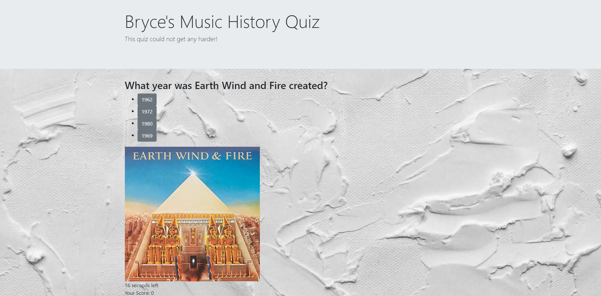
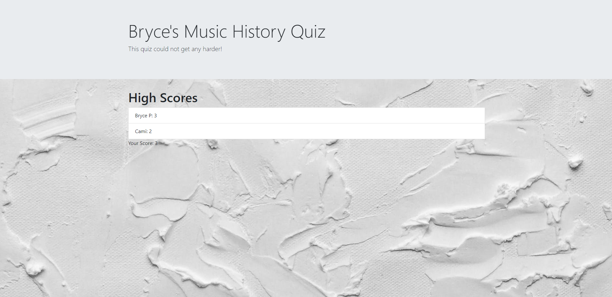

# codequiz

GitHub repo link: https://github.com/Brycetp11/codequiz

CodeQuiz link: https://brycetp11.github.io/codequiz/

Screenshot of quiz: 

For this assignment, I was tasked with creating a multiple choice quiz which stored the user name and score in local storage to be populated into the high score list. 

Firstly I defined my global variables, which included the HTML elements to be referenced later. I created 3 seperate objects which were the questions in the quiz, and their 4 answer options.

Then came the 3 functions, one for each question. Inside the function, I grabbed the container, and displayed it on the page. Next were to define the variables and text content for the questions and buttons. Lastly I added an event listener to each button options which would either increase your score by 1 for a correct answer, or reduce your time by 15 seconds for a wrong answer. In all cases, giving an answer would prompt the next question to appear (repeat for questions 2 and 3).

Using another function, I created an array filled with objects to be stored in local storage, and then used a sort function which would arrange the array with scores from highest to lowest. Then I sent the user to the high score page which would display their score in comparison to others.